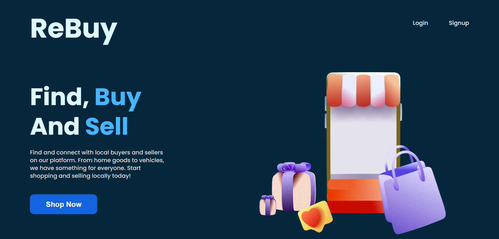
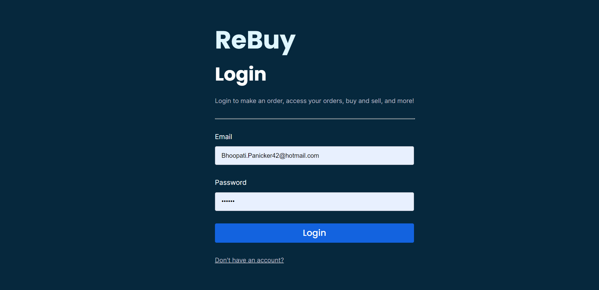
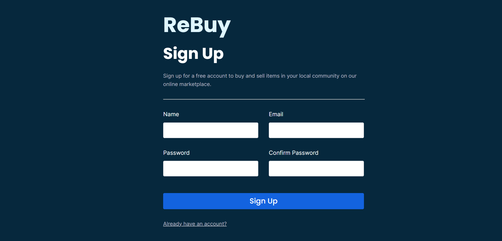
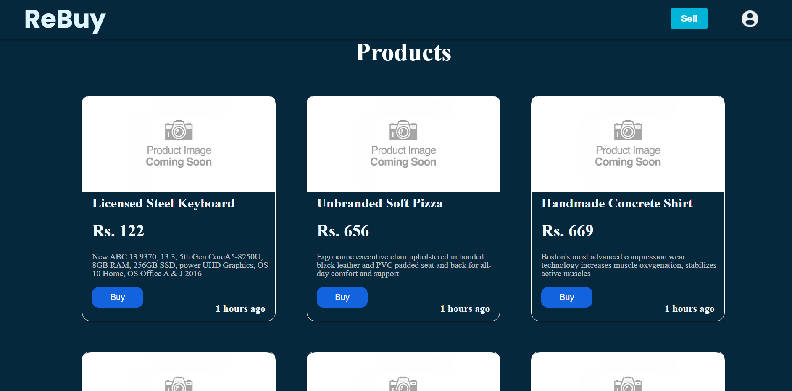
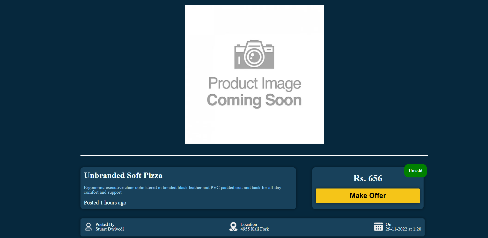
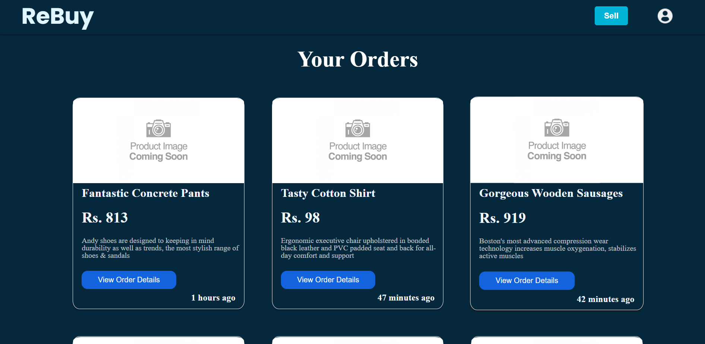
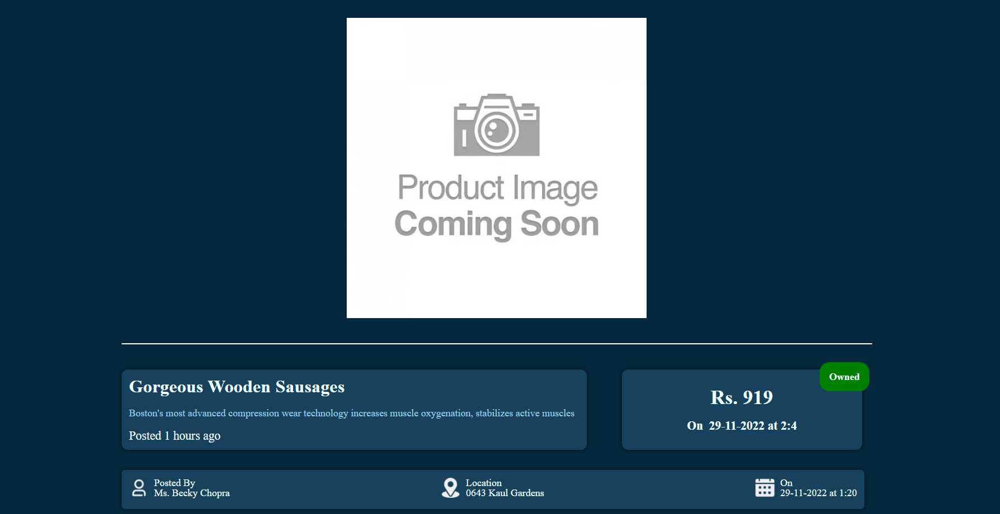
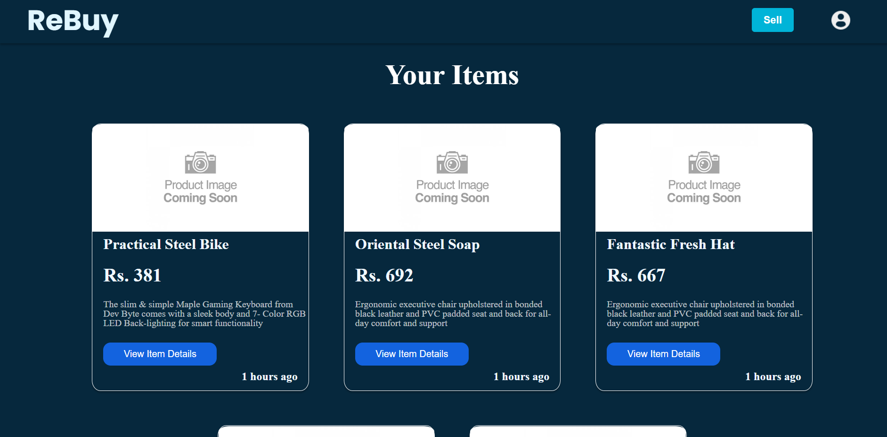
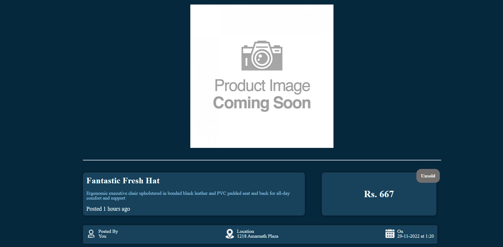
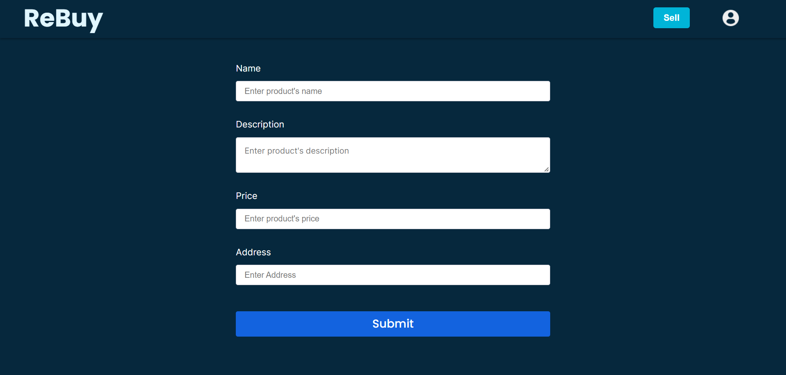

# ReBuy-frontend

This is my attempt to make a clone of an OLX type website in REACT.

## Important Points

- The repo link of this project's backend- [ReBuy-backend](https://github.com/thecurious1-sudo/ReBuy-backend)
- This website is hosted at [ReBuy](https://re6uy.netlify.app/)

## Features

- [x] User can login and register
- [x] User can see items available for sale(unsold ones)
- [x] User can sell his/her own items and see their status(sold/unsold)
- [x] User can see all his/her purchases

## Future Features

- [ ] User can upload images of their item
- [ ] User can edit the details of their items
- [ ] Search bar to view products based on filters(categories, locations, pricing etc)
- [ ] Mobile-friendly

## Run Locally

These instructions will get you a copy of the project up and running on your local machine for development and testing purposes.

### Prerequisites

You will need Node.js and npm (which comes with Node) installed on your machine.

### Installation

1. Clone the repository:

```bash
  git clone https://github.com/thecurious1-sudo/ReBuy-frontend
```

2. Go to the project directory

```bash
  cd ReBuy-frontend
```

3. Install dependencies

```bash
  npm install
```

4. Start the server

```bash
  npm run start
```

The app will open in your default browser at http://localhost:3000

## Environment Variables

To run this project, you will need to add the following environment variables to your root level .env file

`REACT_APP_BACKEND_URL`=http://localhost:4000 (this is the hosted backend)

## Routes

This is a list of the routes used in ReBuy-frontend, along with a description of their function.

- ### `/` - Landing Page

Displays the landing page of the platform



- ### `/login`- Login Page

Displays the login page of the platform



- ### `/signup`- Signup Page

Displays the signup page of the platform



- ### `/home/`- Home Page

Displays all the products that are **Unsold** and **Except those from the logged in user**



- ### `/home/product/:id` - Product Description Page

Displays all the information about the product with id=`id`



- ### `/home/orders`- Orders Page

Displays all the items **bought** by the logged in user



- ### `/home/orders/:id`- Order Description Page

Displays all the information about the order(i.e. product details and order details like time etc) with id=`id`



- ### `/home/myItems` - Items Page

Displays the list of all the items **posted** by the logged in user



- ### `/home/myItems/:id`- Item Description Page

Displays all the information about a particular item with id=`id` posted by the logged in user.



- ### `/home/sell` - Sell Item Page

Displays a form that allows users to create a new listing for an item they want to **sell**.


